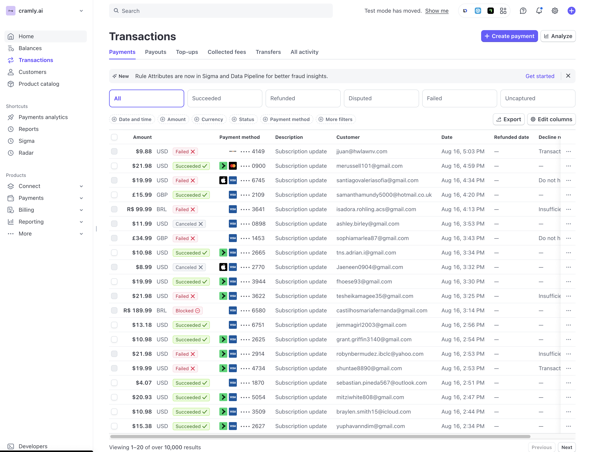

# Design Reference

## Primary Reference

Use [`stripe-base-design.png`](./stripe-base-design.png) as the primary visual reference for the interface.

## Visual Direction

- Create a clean, familiar fintech interface inspired by Stripe's dashboard.
- Reproduce the provided reference and its visible assets as closely as possible.
- Match its overall layout density, visual hierarchy, spacing, typography, controls, borders, colors, table styling, and interaction states.
- Keep the payments table as the primary visual and functional focus.
- Treat surrounding dashboard elements as optional polish rather than required scope.
